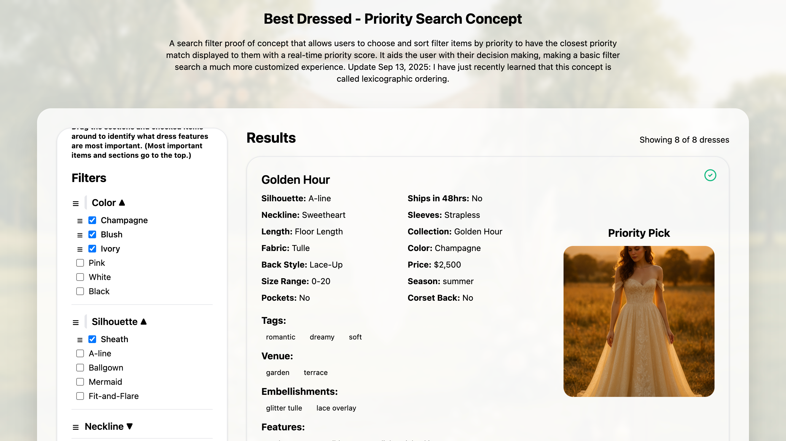
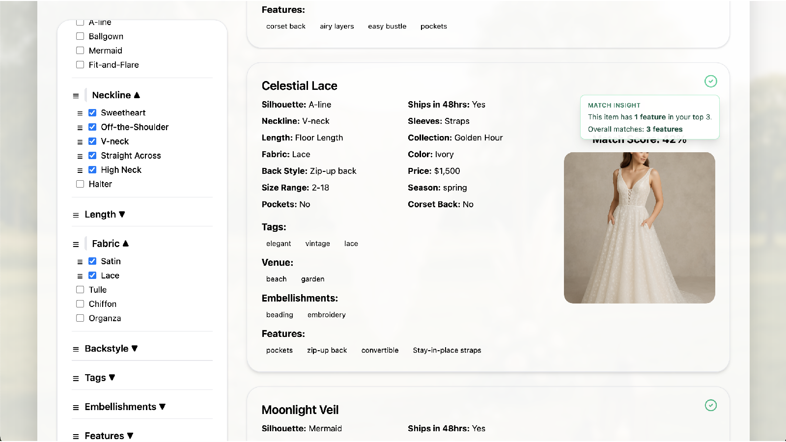

# 👰‍♀️ Best Dressed - E-Commerce Multi-Criteria Decision Analysis Filter

<p align="center">
  
  
  
  
  
  
  
  
  
  
</p>

Best Dressed uses a deterministic weighted scoring model, a form of multi-criteria decision analysis (MCDA), to rank dresses based on user-defined priorities and preferences.
Unlike a machine learning model, this scoring model follows an explicit mathematical formula where each selected attribute contributes a weighted value to the total score.

<p align="center">
  
</p>

<p align="center">
  
</p>
---

## ⚙️ Where Scoring Happens

1. **Payload builder (frontend/src/utils/buildPriorityPayload.ts)**  
   Normalises the drag-and-drop state into a structured `priority` payload (`sections` + per-section order) every time filters change.
2. **Scoring engine (backend/app.py)**  
   Applies feature-flagged dynamic scoring: derives canonical section weights, sums value weights for arrays, picks the best scalar match, logs telemetry, and returns ranked results.
3. **Presentation layer (frontend/src/components/DressList.tsx)**  
   Consumes the server-issued score, provides lexicographic match badges, and surfaces hover tooltips (“top 3” insights) so users understand why an item ranks highly.

Filters still happen in SQL, but the ranking logic currently lives in Python to accommodate SQLite’s pickled array columns. Move to PostgreSQL JSON/ARRAY and the scoring formula can hop into SQL with minor tweaks.

---

## ✨ What It Is and Why?

**Best Dressed** is a full-stack lexicographic web filter that lets users browse and prioritize wedding dresses by silhouette, fabric, season, color, and more.  I built the thing that I wanted to see on ecommerce sites and I haven't seen it used yet.  Search filters only go so far.  I find them to be very...boolean. :s So I thought "could I make a filter for shopping that considers what I find most important in a buying choice?"  I have many tweaks to do but this filter adds a new dimension to shopping >>> user priority.

The key magic is its **priority scoring system**:  
Users can drag entire filter sections *and* individual selected values to rank their importance. Results update in real time with a weighted “match score” and sort lexicographically by user-defined priority order. 💖

---

## 🧩 Tech Stack

| Layer                 | Tooling                                                                 |
|------------------------|----------------------------------------------------------------------|
| **Frontend**            | [React](https://react.dev/), [TypeScript](https://www.typescriptlang.org/), [Vite](https://vitejs.dev/), [Tailwind CSS](https://tailwindcss.com/), [dnd-kit](https://dndkit.com/), [Lucide Icons](https://lucide.dev/) |
| **Backend**             | [Flask](https://flask.palletsprojects.com/), [Flask-CORS](https://flask-cors.readthedocs.io/), [gunicorn](https://gunicorn.org/) |
| **Database**             | SQLite for the demo (`backend/instance/dresses.db`) with BTREE + planned GIN indexes, deploy target [PostgreSQL](https://www.postgresql.org/) via [Supabase](https://supabase.com/) |
| **Storage (images)**     | [Supabase Storage](https://supabase.com/storage) (public bucket) |
| **Hosting**                | Frontend: [Vercel](https://vercel.com/)<br>Backend: [Render](https://render.com/) |
| **Testing**               | [Pytest](https://pytest.org/) for backend scoring, [Vitest](https://vitest.dev/) + [Testing Library](https://testing-library.com/) for React |
| **Dev Tools**               | npm, [axios](https://axios-http.com/), feature flags, match insight telemetry |

---

## 🌐 Live Architecture

```plaintext
┌─────────────┐       HTTPS        ┌─────────────┐       SQL         ┌──────────────┐
│  Frontend   │  ───────────────▶  │   Backend   │  ───────────────▶ │  Supabase DB │
│ (Vercel)    │                    │ (Render)    │                   │ (PostgreSQL) │
│             │                    │             │                   └──────────────┘
│  VITE_IMG_  │                    │  Serves     │
│  BASE_URL   │ ───────────────▶   │ /api/dresses│
│ (Supabase)  │                    │             │
└─────────────┘                    └─────────────┘
        ▲
        │ Loads dress images from Supabase public storage
```

---

## 🚀 Getting Started Locally

### Prerequisites
- Node.js + npm
- Python 3.11+
- PostgreSQL

---

### Backend Setup

```bash
cd backend
python3 -m venv venv
source venv/bin/activate
pip install -r requirements.txt

# (Optional) Seed the database
python seed.py

# Enable dynamic scoring (feature flag) and start the backend
export ENABLE_DYNAMIC_SCORING=true
python app.py
```

---

### Frontend Setup

```bash
cd frontend
npm install

# create a .env file
echo "VITE_API_BASE=http://127.0.0.1:5050" >> .env
echo "VITE_IMG_BASE_URL=http://127.0.0.1:5050/static/images" >> .env

# run local dev server
npm run dev
```

---

## 🔢 Dynamic Scoring API

`POST /api/dresses` accepts either explicit weights or ordered priorities. With the feature flag enabled the backend derives canonical weights from user drag order.

```jsonc
{
  "filters": {
    "fabric": ["Lace"],
    "price": ["1500-2000"]
  },
  "priority": {
    "sections": ["color", "fabric"],
    "values": {
      "color": ["ivory", "champagne"],
      "fabric": ["lace", "organza"]
    }
  },
  "page": { "limit": 24, "offset": 0 },
  "debug": false
}
```

Response (abridged):

```jsonc
{
  "items": [{ "id": 1, "name": "Celestial Lace", "score": 16384.0, "...": "..." }],
  "total_count": 10,
  "pageInfo": { "limit": 24, "offset": 0, "returned": 10, "hasNextPage": false },
  "debug": {
    "weights_source": "priority",
    "duration_ms": 3.8,
    "score_stats": { "min": 0, "median": 4096, "max": 16384 }
  }
}
```

- Supply `debug: true` to include section-level scoring traces.
- UI also surfaces a hover badge with “top 3” and overall match counts per dress.
- `docs/perf/dynamic_scoring.md` contains the latest query-plan snapshots and indexing notes.

---

## 🗄️ Database & SQL Notes

- Demo runs on SQLite (`backend/instance/dresses.db`); production points at Supabase/PostgreSQL.
- Schema (`backend/seed.sql`) includes BTREE indexes for scalar columns and GIN indexes for arrays (tags, embellishments, features, etc.). The Flask boot sequence mirrors these CREATE INDEX statements defensively.
- After index creation the app executes `ANALYZE wedding_dresses` so the planner keeps bitmap index scans available once the table grows beyond demo size.
- Array-valued columns are stored as pickled lists in SQLite; the scoring engine loads them into Python sets and multiplies matches by section weight. PostgreSQL deployments can swap in JSON/ARRAY columns and move this logic into pure SQL if desired.

---

## ✅ Testing

```bash
# backend
cd backend
python3 -m venv venv
source venv/bin/activate
pip install -r requirements.txt
pytest

# frontend
cd frontend
npm install
npm run test   # Vitest + Testing Library
npm run build
```

---

## 🌸 Screenshots

| Filter Panel (Drag + Drop) | Live Priority Results |
|:--------------------------:|:---------------------:|
|  |  |

> 📌 *Add screenshots to `/screenshots` folder as `filter-panel.png` and `priority-results.png` to make them appear here.*

---

## 🌍 Live Demo

- **Frontend:** [best-dressed.vercel.app](https://best-dressed.vercel.app)
- **Backend API:** [best-dressed-api.onrender.com](https://best-dressed-api.onrender.com/api/dresses)
- **Image Storage:** [Supabase public bucket](https://supabase.com/)

---

## 💖 Credits

Built with:
- curiosity
- many snacks 🍅
- much perseverance
- and more error messages than anyone should ever see 😅

